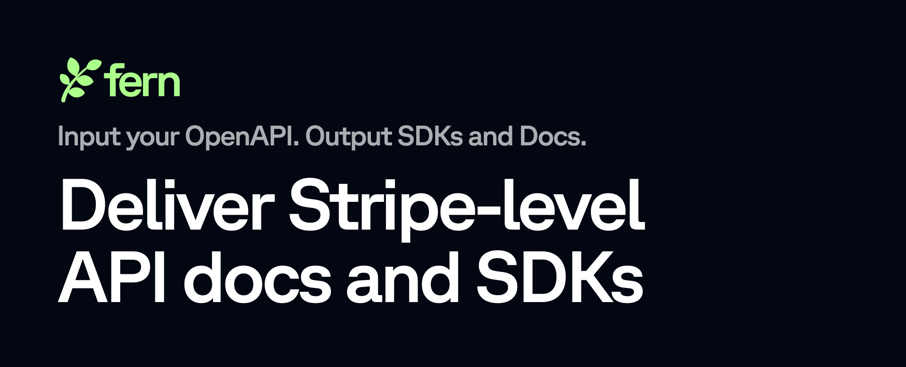

# Fern Typescript Library


<br/>

[](https://www.npmjs.com/package/@fern-api/typescript-sdk)
[](https://github.com/fern-api/fern)

<!--  -->


The Fern Typescript library provides access to the Fern's Public API from JavaScript/TypeScript, and from the JavaScript runtime of your choice ([Node, Browser, Deno, Bun and more](#runtime-compatiblity)).

## Documentation

API reference documentation is available [here](https://buildwithfern.com/learn/api/api-reference/docs/generate).

This SDK primarily serves as a way to access Fern's **dynamic snippets** API. Fern's dynamic snippets API is meant to allow users to create code snippets for their Fern-generate SDKs with dynamic payloads.

Common use cases include:
1. In-app code examples
2. User-specific code examples in your documentation
3. So much more!

<br/>

Notable features:
1. [Client-side execution](#client-side-execution), ideal for code examples that change often, potentially due to user input in a browser.
2. [Dynamic code examples](#dynamic-code-examples)
3. [Displaying default and auto-generated examples](#default-or-static-code-examples)

## Installation

```
npm install --save @fern-api/typescript-sdk

# or

yarn add @fern-api/typescript-sdk
```

## Usage

### Client-side Execution
```typescript
import { Fern } from "@fern-api/typescript-sdk";

const fern = new Fern({
    token: "YOUR_API_KEY",
});

// Get the snippet template from the Fern API
const template = await fern.templates.get({
  endpoint: {
    method: "POST",
    path: "/api/users/search/{someFilter}",
  },
});

// Build a snippet with a payload, this happens on the client side,
// without need for another API call, improving latency dramatically.
const snippet1 = template.resolve({
    pathParameters: [{
      name: "someFilter",
      value: "test1"
    }]
    requestBody: {
      name: "Joey",
    }
  })

// You can build as many snippets as you'd like!
const snippet2 = template.resolve({
  pathParameters: [{
    name: "someFilter",
    value: "anotherTest"
  }]
  requestBody: {
    name: "Samantha",
  }
})
```

### Dynamic Code Examples
```typescript
import { Fern } from "@fern-api/typescript-sdk";

const fern = new Fern({
    token: "YOUR_API_KEY",
});

const snippets = await fern.snippets.get({
  endpoint: {
    method: "POST",
    path: "/api/users/search/{someFilter}",
  },
  // The payload parameter allows you to pass in the same data you would to the API,
  // the only distinction is that the payload is structure to distinguish path and query parameters,
  // headers and request bodies.
  payload: {
    pathParameters: [{
      name: "someFilter",
      value: "test1"
    }]
    requestBody: {
      name: "Joey",
    }
  }
});
```

### Default or Static Code Examples
```typescript
import { Fern } from "@fern-api/typescript-sdk";

const fern = new Fern({
    token: "YOUR_API_KEY",
});

// Without any payload specified, the SDK returns a snippet with the examples provided within your API spec
// If there are no examples in your spec, a basic example is autogenerated for you.
const snippets = await fern.snippets.get({
  endpoint: {
    method: "GET",
    path: "/api/users",
  },
  // The name of your organization, found in your `fern.config.json`
  orgId: "my_organization",
  // The name of the API you'd like to generate snippets for,
  apiId: "api",
  sdks: [{ "type": "python", "package": "my_package", "version": "0.0.3" }],
});
```


### Handling Errors
When the API returns a non-success status code (4xx or 5xx response), 
a subclass of [FernError](./src/errors/FernError.ts)
will be thrown:

```ts
import { FernError } from "@fern-api/typescript-sdk";

try {
  await fern.snippets.get(...);
} catch (err) {
  if (err instanceof FernError) {
    console.log(err.statusCode); 
    console.log(err.message);
    console.log(err.body); 
  }
}
```

### Request Options

The HTTP Client accepts a `RequestOptions` class where you can specify 
a customized timeout. 

```typescript
const snippets = await fern.snippets.get(
  {
    endpoint: {
      method: "GET",
      path: "/api/users",
    }
  }, 
  {
    timeoutInSeconds: 60 // increase timeout in second
  });
```

### Runtime compatiblity

The SDK defaults to `node-fetch` but will use the global fetch client if present. The SDK 
works in the following runtimes: 

The following runtimes are supported:

- Node.js 15+ 
- Vercel 
- Cloudflare Workers
- Deno v1.25+
- Bun 1.0+


## Beta status

This SDK is in beta, and there may be breaking changes between versions without a major version update. Therefore, we 
recommend pinning the package version to a specific version in your package.json file. This way, you can install the 
same version each time without breaking changes unless you are intentionally looking for the latest version.

## Contributing

While we value open-source contributions to this SDK, this library is generated programmatically. 
Additions made directly to this library would have to be moved over to our generation code, otherwise 
they would be overwritten upon the next generated release. Feel free to open a PR as a proof of concept, 
but know that we will not be able to merge it as-is. We suggest opening an issue first to discuss with us!

On the other hand, contributions to the README are always very welcome!

<br/>

